# 🏦 Delinquency Risk Prediction System: End-to-End MLOps Pipeline

> **Predict loan delinquency risk with automated retraining, drift detection, and deployment, built for production.**

This project demonstrates a **complete, production-grade MLOps system** for predicting loan delinquency risk. It includes everything from synthetic data generation to model training, validation, API serving, automated retraining, drift detection, and deployment, all following **2025 industry standards**.

Built by an M.Sc. student in Information and Data Science at Addis Ababa University, this system is designed to be **scalable, maintainable, and deployable**, ready for real-world use in Ethiopian fintech or microfinance institutions.

---

## 🚀 Features

| Feature | Description |
|----------|------|
✅ **Synthetic Data Generation** | Realistic Ethiopian-style loan data  |
✅ **Model Training & Evaluation** | Logistic Regression, Random Forest, XGBoost with AUC comparison  |
✅ **FastAPI REST API** | Serves predictions with input validation and structured logging  |
✅ **MLflow Tracking** | Logs experiments, parameters, and metrics locally  |
✅ **DVC for Data Versioning** | Tracks raw and processed datasets  |
✅ **Automated Retraining** | GitHub Actions retrain model weekly  |
✅ **Drift Detection** | Evidently AI monitors input data drift  |
✅ **Model Deployment** | Auto-deploys to Railway.app with beautiful UI  |
✅ **Lifespan Events** | Uses modern FastAPI `lifespan` (replaces deprecated `@app.on_event`)  |
✅ **Pydantic V2 Validation** | Uses `@field_validator` (replaces deprecated `@validator`)  |
✅ **Artifact v4 Compliance** | Uses `actions/upload-artifact@v4` (required after Jan 30, 2025)|

---

## 🧱 Tech Stack

| Component | Tool |
|----------|------|
| Language | Python 3.10+ |
| ML Framework | Scikit-learn, XGBoost |
| Experiment Tracking | MLflow |
| Data Versioning | DVC |
| API Framework | FastAPI (with `lifespan`) |
| Validation | Pydantic V2 (`@field_validator`) |
| Containerization | Docker (optional) |
| CI/CD | GitHub Actions |
| Hosting | Railway.app (free tier) |
| Drift Detection | Evidently AI |
| Frontend | HTML, Bootstrap, JavaScript |

---

## 📂 Project Structure
```
delinquency-risk-mlops/
│
├── data/
│ ├── raw/ # Raw datasets (versioned by DVC)
│ └── processed/ # Processed datasets
├── models/ # Trained models, scalers, encoders
├── reports/ # Drift detection reports (HTML/JSON)
├── scripts/
│ ├── retrain.py # Retrains models, picks best, saves artifacts
│ └── detect_drift.py # Detects data drift, decides if retraining needed
├── src/
│ ├── train.py # Initial training script (logged in MLflow)
│ └── preprocess.py # (Optional) Preprocessing utilities
├── static/
│ └── index.html # Beautiful frontend UI for predictions
├── app.py # FastAPI server with /predict, /health, /model-info
├── requirements.txt # Python dependencies
├── .gitignore # Ignores logs, temp files
├── .github/workflows/
│ └── retrain.yml # GitHub Actions: Retrain + Deploy weekly
├── README.md # You are here!
└── DVC config files # For data versioning
```


---

## 🛠️ Setup & Installation (Local Development)

### 1. Clone the Repository

```bash
git clone https://github.com/meselekebede/delinquency-risk-mlops.git
cd delinquency-risk-mlops
```

### 2. Set Up Virtual Environment
```
python -m venv venv
# Activate (Windows)
venv\Scripts\activate
# Activate (Mac/Linux)
source venv/bin/activate
```

### 3. Install Dependencies
```
pip install --upgrade pip
pip install -r requirements.txt
```

### 4. Initialize DVC & MLflow
```
dvc init
mlflow ui --backend-store-uri ./mlruns  # Start MLflow server in new terminal
```

### 5. Generate Synthetic Data & Train Initial Model
```
python src/train.py
```

### 6. Run Drift Detection (Optional)
```
python scripts/detect_drift.py
```
### 7. Start FastAPI Server
```
uvicorn app:app --reload
```

Visit:

API Docs: http://127.0.0.1:8000/docs \
Beautiful UI: http://127.0.0.1:8000

## ☁️ Deployment to Railway.app

### 1. Push to GitHub
```
git add .
git commit -m "feat: ready for deployment"
git push origin main
```

### 2. Deploy on Railway

 ✅ Go to Railway.app and sign in with GitHub. \
 ✅ Click “New Project” → “Deploy from GitHub repo”. \
 ✅ Select your repository. \
 ✅ In Settings → Variables, add: \
 ✅ GITHUB_TOKEN: Your GitHub Personal Access Token (for downloading models) \
 ✅ Set Build Command: pip install -r requirements.txt \
 ✅ Set Start Command: uvicorn app:app --host 0.0.0.0 --port $PORT \
 ✅ Click Deploy. \
 ✅ Your live app will be at: https://your-project.up.railway.app

## 🔄 Automated Retraining & Drift Detection
### How It Works
Every Sunday at 00:00 UTC, GitHub Actions triggers retrain.yml.
It runs scripts/retrain.py to:
1. Load existing data
2. Simulate new loan records
3. Retrain all models
4. Pick the best model by AUC
5. Save it as models/model.pkl
6. Generate model_metadata.json
7. It uploads the new model as an artifact: delinquency-model-latest.
8. On next startup, FastAPI downloads the latest model from GitHub Actions.

### Enable Drift Detection (Optional)
Uncomment the drift detection step in .github/workflows/retrain.yml:
```
- name: 🔍 Run drift detection
  run: python scripts/detect_drift.py
```
The script will only retrain if drift exceeds 30%.

## 📊 Monitoring & Governance
### Model Info Endpoint: Call GET /model-info to see:
    1. Which model is active (e.g., "Random Forest")
    2. Its AUC score
    3. When it was last retrained
    4. Feature list
    
### Drift Reports
After running detect_drift.py, open reports/data_drift.html to see interactive drift analysis.

### Health Check
Call GET /health to verify the API is running and model is loaded.

## 🧪 Testing
Run edge case tests:
```
python test_edge_cases.py
```
Tests include:
```
Invalid categories
Extreme values
Missing fields
Stress testing
```
## 📄 License
This project is licensed under the MIT License — see the LICENSE file for details.

## 🙏 Acknowledgements
1. Addis Ababa University, For academic support and resources.
2. FastAPI, MLflow, Evidently AI, DVC, Railway, For powerful open-source tools.
3. GitHub Actions, For free CI/CD.

## 💡 Future Work
1. Model Registry: Integrate MLflow Server or Weights & Biases.
2. Blue/Green Deployment: Zero-downtime model updates.
3. Professional Dashboards: Grafana for real-time metrics.
4. Secure Tokens: Use GitHub App instead of PAT.
5. Database Integration: Connect to PostgreSQL for real loan data.
6. User Authentication: Add login for loan officers.
7. Real data integrations: Integrate the system to use real data sources such as databases, csv, excel and so on instead of synthetic data

# Project Architecture
### Legend:
1. data:
    


3. training: 
   

5. serving: 
   

6. monitoring:
   


8. automation:

```mermaid
flowchart TD
    A[Synthetic Loan Data] --> B[Preprocessing & Feature Engineering]
    B --> C[Model Training: Logistic, RF, XGBoost]
    C --> D[Evaluate Models: AUC, F1, Accuracy]
    D --> E[Save Best Model: model.pkl + metadata]
    E --> F[Log to MLflow]
    F --> G[Upload Artifact: GitHub Actions v4]

    H[FastAPI App Startup] --> I[Download Model from GitHub Artifact]
    I --> J[Load Model + Encoders]
    J --> K[API Endpoints: /predict, /health, /model-info]
    K --> L[Frontend UI: User Form]
    L --> M[Validate Input: Pydantic V2]
    M --> N[Predict Risk: Random Forest]
    N --> O[Return Risk Level: Low/Medium/High]

    P[Log Predictions] --> Q[Detect Drift: Evidently AI]
    Q --> R[Generate Report: data_drift.html]
    R --> S{Drift > 30%?}
    S -->|Yes| T[Trigger Retraining]
    S -->|No| U[Continue Serving]

    T --> V[GitHub Actions: retrain.yml]
    V --> W[Run Weekly: cron Sun 00:00 UTC]
    W --> X[Retrain Models: scripts/retrain.py]
    X --> Y[Upload New Artifact]
    Y --> Z[Commit + Redeploy if configured]
    Z --> AA[FastAPI Downloads New Model]

    %% Connections
    G --> I
    O --> P
    AA --> J

    %% Styling (GitHub supports this)
    classDef data fill:#0f0f0f,stroke:#2e8b57;
    classDef training fill:#c30ee3,stroke:#2e8b57;
    classDef serving fill:#112bf0,stroke:#6a5acd;
    classDef monitoring fill:#a60515,stroke:#cc503a;
    classDef automation fill:#05a69e,stroke:#6a5acd;

    class A,B data
    class C,D,E,F,G training
    class H,I,J,K,L,M,N,O serving
    class P,Q,R,S,T,U monitoring
    class V,W,X,Y,Z,AA automation
```
   


